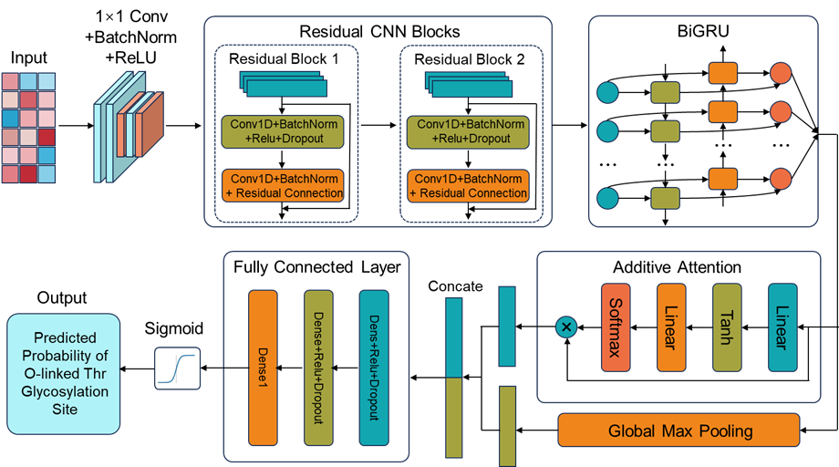
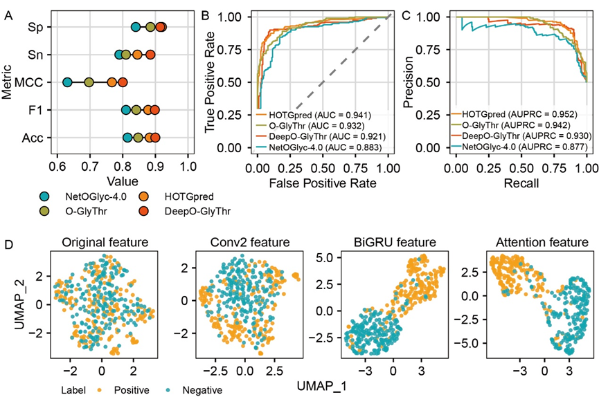
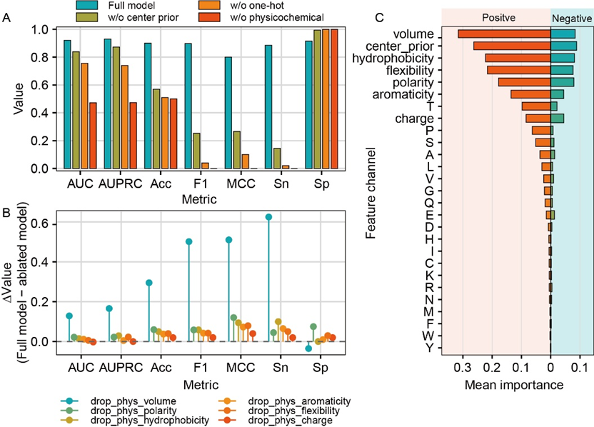
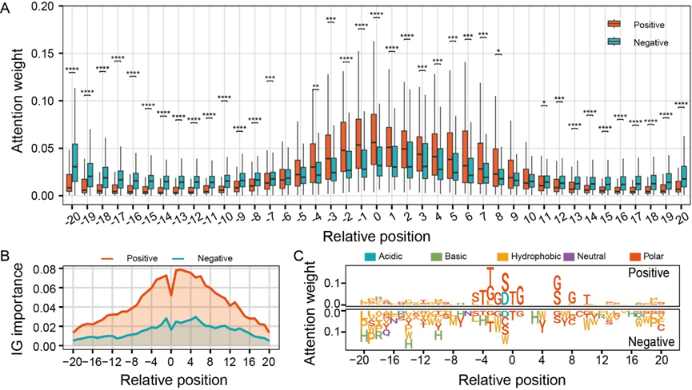
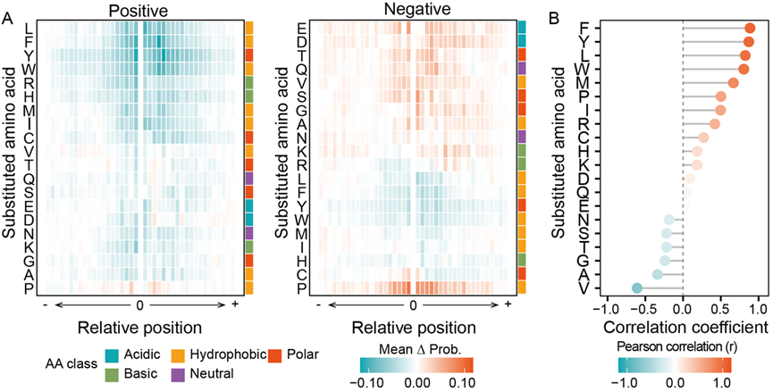

# DeepO-GlyThr

an interpretable sequence-based deep learning framework for human O-linked threonine glycosites prediction.

This package includes:

- the trained model file `models/model.pt`
- a command-line interface
- attention visualization
- Integrated Gradients for single-window explanation
- single-window feature ablation analysis

## Features

- Accept FASTA files or a single raw amino-acid sequence
- Support both 41-aa Thr-centered windows and full-length protein scanning
- Return prediction probability and binary label
- Show attention across the 41-aa window
- Show IG attribution by position and feature group
- Show single-window probability drop after masking feature groups

## Repository structure

```text
github/
├── cli.py
├── requirements.txt
├── README.md
├── assets/
│   ├── f1.png
│   ├── f2.png
│   ├── f3.png
│   ├── f4.png
│   └── f5.png
├── examples/
│   └── example.fasta
|   └── train.fa
|   └── test.fa
├── models/
│   └── model.pt
└── deepoglythr/
    ├── __init__.py
    ├── constants.py
    ├── core.py
    └── model.py
```

## Installation

Create and activate a Python environment, then install dependencies:

```bash
pip install -r requirements.txt
```

## Run the CLI

### 1. Predict from a FASTA file

```bash
python cli.py --input examples/example.fasta
```

### 2. Predict from a single sequence

```bash
python cli.py --sequence MNFSLKSSSSSSFSATSLAASRPGGSPRATTTGPVVTTSGTTTSSAPTTTTATTTQPSAATTTTSA
```

This produces:

- `DeepO-GlyThr-results.csv`
- `DeepO-GlyThr-details.json`

The CSV contains the prediction summary for all valid windows.
The JSON contains the per-window explanation objects, including:

- prediction probability
- attention weights
- IG attribution by position
- IG attribution by feature group
- single-window ablation effect

## Input rules

- Only the 20 standard amino acids are supported: `ACDEFGHIKLMNPQRSTVWY`
- If the sequence length is exactly 41, the residue at position 21 must be `T`
- If the sequence is longer than 41, all valid threonines with at least 20 upstream and 20 downstream residues will be scanned

## Output description

### Prediction summary

- `window_id`: unique identifier for the candidate window
- `source_id`: original sequence identifier
- `site_position`: 1-based Thr position in the source sequence
- `probability`: model score
- `prediction`: `Positive` when probability >= 0.5, otherwise `Negative`

### Attention

Attention reflects which positions the model emphasized while aggregating the sequence representation.

### Integrated Gradients

IG estimates per-position and per-feature attribution for the selected 41-aa window.

### Single-window ablation

This is not the manuscript-level benchmark ablation across the full test set. It is a local explanation:
for the current 41-aa window, one feature group is masked at a time and the probability drop is recorded.

## Figures

### Overview of DeepO-GlyThr



The overall workflow of DeepO-GlyThr, from sequence encoding to interpretable prediction.

### Performance comparison and representation learning



Comparison with representative methods and visualization of how the model progressively separates positive and negative samples.

### Feature ablation and importance analysis



Ablation results showing the importance of physicochemical features, positional prior, and residue identity for model performance.

### Attention distribution and position-wise attribution



Attention and attribution analyses highlighting the dominant sequence context around the central threonine.

### In silico mutagenesis analysis



Residue substitution analysis showing how local perturbations alter predicted O-linked threonine glycosylation probability.

## Notes

- The included model file is loaded from `models/model.pt`
- GPU is used automatically when available; otherwise CPU is used
- The package and CLI share the same inference code
